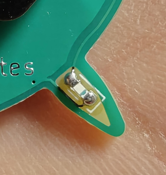

# Assembly instructions

1. Start with soldering the resitors. (6 pcs)
2. Then solder the LEDs (6 pcs)
* make sure the LED is upside down (it should shine into the PCB)
* green mark points to the kathode [white edge on the footprint])

3. Battery holder (the battery is going to be inserted from below)
4. The pin/switch 
* it is two parts, make sure there is enough solder to keep it secured, otherwise the tension might make it pop)
