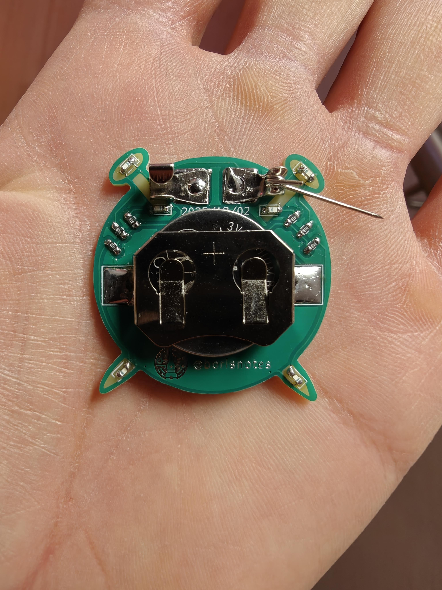
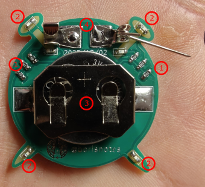
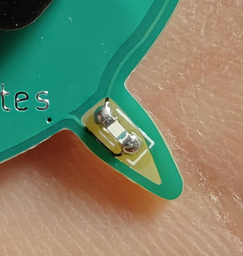

# Knit & Yarn Badge

A round PCB badge shaped like a ball of yarn with knitting needles. Six LEDs shine through the board face-down, lighting up the design from behind. Powered by a CR2032 coin cell; the brooch pin doubles as the power switch.

Designed in KiCad. Three badge variants and one SAO variant are included.

---

## Versions

| Folder | Description |
|--------|-------------|
| `knit_yarn_badge_v1` | First prototype — through-hole battery holder |
| `knit_yarn_badge_v2` | SMD redesign, improved layout |
| `knit_yarn_badge_v3` | Current version — 0805 components, no vias |
| `knit_yarn_SAO` | Simple Add-On variant with 2×2 header |

---

## Bill of Materials (per badge)

| Reference | Component | Package | Qty |
|-----------|-----------|---------|-----|
| D1–D6 | LED (any color) | 0805 | 6 |
| R1–R6 | Resistor | 0805 | 6 |
| BT1 | CR2032 coin cell holder | THT | 1 |
| SW1 | Brooch pin / SPST switch | custom | 1 |

> **Note:** Resistor values depend on your LED choice. For a standard 2V LED with a 3V CR2032 at ~10 mA per LED: R = (3V − 2V) / 10 mA = **100 Ω**.

---

## Ordering

Ready-to-order Gerber zips are in the [`order/`](./order/) folder:

- [`order/knit_yarn_badge_v1.zip`](./order/knit_yarn_badge_v1.zip)
- [`order/knit_yarn_badge_v2.zip`](./order/knit_yarn_badge_v2.zip)
- [`order/knit_yarn_badge_v3.zip`](./order/knit_yarn_badge_v3.zip) ← recommended
- [`order/knit_yarn_SAO.zip`](./order/knit_yarn_SAO.zip)

Upload the zip directly to your PCB fab (JLCPCB, PCBWay, etc.).

---

## Assembly

1. **Resistors** — solder all 6 first (they're the lowest-profile component)
2. **LEDs** — place them **face down** (they shine into the PCB, not away from it)
   - The green mark on the LED points to the cathode, which aligns with the white edge on the footprint

   

3. **Battery holder** — battery inserts from the back
4. **Brooch pin** — two-part assembly; use enough solder on both pads or the tension from clipping it may pop it loose

---

## SVG Source Files

The artwork SVGs used to generate the board graphics live in [`svg_source/`](./svg_source/).
